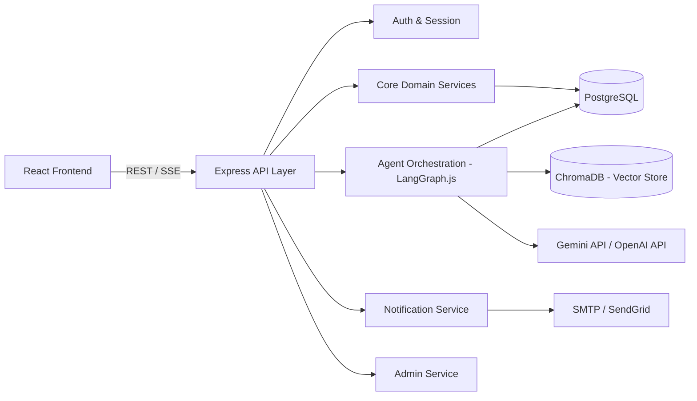
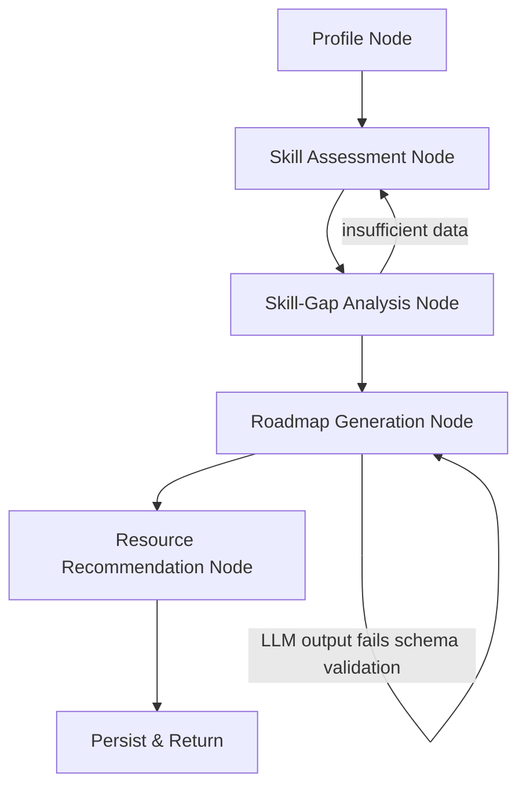

# Backend PRD — PrepAgent
 
**Agentic Placement Preparation Coach**
Backend-only scope. Single-service architecture: Node.js / Express.js (TypeScript) with LangChain.js + LangGraph.js for the AI/agent layer.
 
---
 
## 1. Purpose & Scope
 
This document specifies the backend system for PrepAgent: data model, API surface, AI-agent architecture, and engineering standards needed to build, test, and ship the service within a 16-week timeline. Frontend concerns are explicitly out of scope.
 
The backend owns:
- Student accounts, profiles, and authentication
- Skill assessment storage, grading, and history
- Skill-gap analysis against target-company requirements
- AI-agent orchestration for roadmap generation and resource recommendation
- A conversational AI endpoint (placement-coach chat)
- Notifications, admin operations, and reporting
---
 
## 2. System Overview
 

 
One deployable Node/Express service. The AI/agent layer is a module within the same codebase (`/src/agents`), not a separate network service — see [ADR-1](#10-architecture-decisions-adrs).
 
---
 
## 3. Backend Feature List
 
### 3.1 Auth & Profile
- Register/login (email + password; OAuth optional, deferred)
- JWT access + refresh token issuance and rotation
- Profile CRUD: educational background, programming skills, technical subjects, target companies, preparation timeline
- Profile change history (for roadmap re-generation triggers)
### 3.2 Skill Assessment Engine
- Question bank storage (coding, aptitude, technical, tagged by topic/difficulty/company)
- Assessment session lifecycle: start → answer → submit → grade
- Auto-grading: exact-match/MCQ grading synchronously; code-problem grading via test-case runner (or LLM-assisted rubric grading as a fallback)
- Adaptive difficulty: next-question selection based on rolling accuracy
- Assessment result persistence and historical trend queries
### 3.3 Skill-Gap Analysis
- Company requirement profiles (topic → expected proficiency level)
- Gap computation: student proficiency vector vs. company requirement vector
- Gap output: ranked list of weak topics with severity score
### 3.4 Roadmap Generation (Agent-Driven)
- Triggered on: profile completion, assessment completion, or manual "regenerate"
- LangGraph.js pipeline (see [Section 5](#5-ai-agent-architecture)) producing a structured, week-by-week roadmap
- Roadmap persistence with versioning (each regeneration creates a new version, previous versions retained)
### 3.5 Resource Recommendation
- Retrieval-augmented lookup against ChromaDB (embedded problems/articles/questions)
- Filter by topic, difficulty, and company tag
- Recommendation persisted per roadmap item for progress tracking
### 3.6 Progress Tracking
- Completion events per roadmap item (`started`, `completed`, `skipped`)
- Aggregate progress computation (percent complete per topic, pace vs. plan)
### 3.7 AI Chat Agent
- Stateful conversational endpoint, streamed via SSE
- Context: student profile + current roadmap + retrieved knowledge-base chunks (RAG)
- Persisted conversation history per student
### 3.8 Notifications
- Scheduled reminder jobs (pending milestones, re-assessment due)
- Email dispatch via SMTP/SendGrid
- In-app notification records (read/unread state) served over REST
### 3.9 Admin Operations
- CRUD for question bank, learning resources, company requirement profiles
- Usage analytics (active students, assessments taken, roadmap completion rates)
- Role-gated (`admin` role required)
### 3.10 Reporting
- Exportable progress report (PDF or JSON) per student
- Skill-gap summary report
---
 
## 4. Data Model (Core Entities)
 
| Entity | Key Fields |
|---|---|
| `User` | id, email, password_hash, role, created_at |
| `Profile` | user_id, education, programming_skills[], technical_subjects[], target_companies[], timeline_weeks |
| `Question` | id, type (coding/aptitude/technical), topic, difficulty, company_tags[], content, answer_key |
| `AssessmentSession` | id, user_id, started_at, submitted_at, score, topic_breakdown (json) |
| `CompanyRequirement` | company_id, topic, expected_level |
| `Roadmap` | id, user_id, version, generated_at, status (active/superseded), weeks (json) |
| `RoadmapItem` | id, roadmap_id, week_no, topic, resource_refs[], status |
| `Resource` | id, type (problem/article/question), topic, difficulty, company_tags[], embedding_id (Chroma ref) |
| `ChatMessage` | id, user_id, role (user/agent), content, created_at |
| `Notification` | id, user_id, type, payload, read_at |
| `AdminAuditLog` | id, admin_id, action, target, timestamp |
 
Relational data (all of the above except embeddings) lives in **PostgreSQL**. Vector embeddings for `Resource` content live in **ChromaDB**, referenced by `embedding_id`.
 
---
 
## 5. AI Agent Architecture
 
### 5.1 Framework
**LangGraph.js** models the roadmap pipeline as an explicit, stateful graph — each stage is a node with defined input/output state, making the flow debuggable, resumable, and independently testable. **LangChain.js** supplies prompt templates, the LLM client abstraction, and the ChromaDB retriever tool used by graph nodes.
 
### 5.2 Roadmap Generation Graph
 

 
| Node | Input State | Responsibility | Output State |
|---|---|---|---|
| Profile Node | raw profile | Normalize profile into a structured skill vector | `skillProfile` |
| Skill Assessment Node | `skillProfile`, latest assessment results | Merge assessed proficiency into skill vector | `assessedProfile` |
| Skill-Gap Analysis Node | `assessedProfile`, target company requirements | Compute ranked gap list | `gapList` |
| Roadmap Generation Node | `gapList`, timeline, LLM | Prompt LLM for a structured week-by-week plan; validate against a strict JSON schema (retry on validation failure, max 2 retries) | `roadmapDraft` |
| Resource Recommendation Node | `roadmapDraft` | For each roadmap item, query ChromaDB retriever for matching resources | `roadmap` (final) |
| Persist & Return | `roadmap` | Write to PostgreSQL, return to caller | — |
 
**Design rules:**
- Every LLM call has a strict output schema (Zod) — the node retries once on schema-validation failure before surfacing an error, never passes malformed data downstream.
- Nodes are pure functions over state where possible, making unit testing straightforward without hitting the LLM (mock the LLM call in node tests).
- The graph is re-entrant: `Skill-Gap Analysis` can loop back to `Skill Assessment` if required assessment data is missing, rather than failing outright.
### 5.3 Chat Agent (separate, lighter graph)
- Single-node RAG chain (not the full roadmap graph): retrieve relevant chunks from ChromaDB using the current message + profile context → construct prompt → stream LLM response via SSE.
- Conversation memory: last N messages passed as context; older history summarized periodically to control token usage.
### 5.4 LLM Provider Abstraction
- A thin provider-agnostic interface (`generate(prompt, schema)`) wraps both Gemini and OpenAI clients.
- Default provider: **Gemini** (cost). Fallback: **OpenAI**, used automatically on Gemini error/timeout, and preferred for structured/function-calling-sensitive nodes (roadmap generation, grading) if Gemini's structured-output reliability proves weaker in testing.
### 5.5 Guardrails
- All agent-generated content is labeled in API responses as `source: "ai_generated"` so the frontend can present it as guidance, not fact.
- Hard timeout per node (e.g., 15s) with graceful degradation (return partial roadmap + error flag rather than hanging the request).
- No agent node has write access beyond its own output state — persistence happens only in the final node, so a failed run never leaves partial writes.
---
 
## 6. API Design
 
### 6.1 Conventions
- REST, JSON, versioned under `/api/v1`
- Auth: `Authorization: Bearer <JWT>` on all routes except `/auth/*`
- Errors: consistent shape — `{ "error": { "code": "STRING_CODE", "message": "..." } }`
- Pagination: `?page=&limit=` with `{ data, page, limit, total }` envelope on list endpoints
- Streaming endpoints (chat, roadmap generation) use Server-Sent Events (`Content-Type: text/event-stream`)
- Rate limiting: per-user limits on assessment submission and chat/agent endpoints (LLM-cost protection)
### 6.2 Endpoint Summary
 
**Auth**
| Method | Path | Description |
|---|---|---|
| POST | `/auth/register` | Create account |
| POST | `/auth/login` | Issue access + refresh token |
| POST | `/auth/refresh` | Rotate access token |
| POST | `/auth/logout` | Revoke refresh token |
 
**Profile**
| Method | Path | Description |
|---|---|---|
| GET | `/profile` | Get current user's profile |
| PUT | `/profile` | Update profile (triggers roadmap staleness flag) |
 
**Assessment**
| Method | Path | Description |
|---|---|---|
| POST | `/assessments` | Start a new assessment session |
| GET | `/assessments/:id/next-question` | Get next adaptive question |
| POST | `/assessments/:id/answer` | Submit an answer |
| POST | `/assessments/:id/submit` | Finalize and grade session |
| GET | `/assessments/history` | List past assessment results |
 
**Skill Gap**
| Method | Path | Description |
|---|---|---|
| GET | `/skill-gap` | Current gap analysis for the logged-in student |
 
**Roadmap**
| Method | Path | Description |
|---|---|---|
| POST | `/roadmap/generate` | Trigger agent pipeline (SSE progress events, final roadmap on completion) |
| GET | `/roadmap` | Get active roadmap |
| GET | `/roadmap/history` | List past roadmap versions |
| PATCH | `/roadmap/items/:id` | Update item status (started/completed/skipped) |
 
**Resources**
| Method | Path | Description |
|---|---|---|
| GET | `/resources` | List/filter recommended resources (topic, difficulty, company) |
 
**Chat**
| Method | Path | Description |
|---|---|---|
| POST | `/chat/message` | Send a message; SSE stream of agent response |
| GET | `/chat/history` | Get prior conversation |
 
**Notifications**
| Method | Path | Description |
|---|---|---|
| GET | `/notifications` | List notifications |
| PATCH | `/notifications/:id/read` | Mark as read |
 
**Admin** (role = `admin`)
| Method | Path | Description |
|---|---|---|
| POST/PUT/DELETE | `/admin/questions` | Manage question bank |
| POST/PUT/DELETE | `/admin/resources` | Manage learning resources |
| POST/PUT/DELETE | `/admin/company-requirements` | Manage company requirement profiles |
| GET | `/admin/analytics` | Usage/engagement analytics |
 
**Reports**
| Method | Path | Description |
|---|---|---|
| GET | `/reports/progress` | Export progress report |
| GET | `/reports/skill-gap` | Export skill-gap summary |
 
---
 
## 7. Coding Best Practices
 
### 7.1 Project Structure — 5-Layer Architecture per Module
 
Every domain module follows the same strict **Route → Validation → Controller → Service → Repository** layering. Each layer only calls the layer directly beneath it — a controller never queries the database, a route never contains business logic, and a service never touches Express's `req`/`res` objects.
 
```
src/
  modules/
    auth/
      auth.routes.ts        # Route layer
      auth.validation.ts    # Validation layer
      auth.controller.ts    # Controller layer
      auth.service.ts       # Service layer
      auth.repository.ts    # Repository layer
      auth.test.ts
    profile/
      profile.routes.ts
      profile.validation.ts
      profile.controller.ts
      profile.service.ts
      profile.repository.ts
      profile.test.ts
    assessment/              (same 5-file pattern)
    skill-gap/                (same 5-file pattern)
    roadmap/                  (same 5-file pattern)
    resources/                 (same 5-file pattern)
    chat/                       (same 5-file pattern)
    notifications/               (same 5-file pattern)
    admin/                        (same 5-file pattern)
  agents/
    graphs/                # LangGraph.js graph definitions
    nodes/                 # Individual node implementations
    prompts/               # Prompt templates, versioned
    llm/                   # Provider abstraction: gemini.ts, openai.ts, index.ts
  db/
    schema/                # Postgres schema / migrations
    client.ts
  vector/
    chromaClient.ts
  middleware/               # auth, error handler, rate limiter, validation-runner
  config/                    # env loading + validation
  utils/
  server.ts
```
 
**Layer responsibilities:**
 
| Layer | File | Responsibility | Must NOT do |
|---|---|---|---|
| **Route** | `*.routes.ts` | Declares the endpoint path/method, wires the validation middleware and controller together. No logic. | Parse business data, touch the DB, format responses |
| **Validation** | `*.validation.ts` | Zod schemas for request body/query/params; exported as Express middleware that rejects invalid input before it reaches the controller | Contain business rules, call services |
| **Controller** | `*.controller.ts` | Reads the validated `req`, calls exactly one service method, maps the result (or thrown `AppError`) to an HTTP response | Contain business logic, run DB queries, call other controllers |
| **Service** | `*.service.ts` | All business logic: orchestrates one or more repositories, applies domain rules, calls agent graphs where relevant (e.g. roadmap service invokes the LangGraph.js pipeline) | Import Express types, build HTTP responses, run raw SQL |
| **Repository** | `*.repository.ts` | Only layer that talks to PostgreSQL/ChromaDB directly; exposes typed data-access methods (`findById`, `create`, `updateStatus`, etc.) | Contain business logic or validation |
 
This keeps each layer independently unit-testable: repositories are tested against a test database, services are tested with mocked repositories, and controllers are tested with mocked services — no layer's test needs to spin up the layers above or below it.
 
### 7.2 Standards
- **TypeScript strict mode** throughout; no implicit `any`.
- **Input validation**: every route validates request body/query with **Zod** schemas at the boundary — never trust client input downstream.
- **Environment config**: all secrets/config loaded via `dotenv` and validated once at boot against a Zod schema (fail fast on missing config, not at first use).
- **Layered architecture enforced**: every module follows Route → Validation → Controller → Service → Repository (see §7.1). Controllers never query the database directly, and services never import Express types — this boundary is checked in code review, not just convention.
- **Error handling**: a single centralized Express error-handling middleware; services throw typed `AppError` instances (`code`, `httpStatus`, `message`) rather than raw errors, which controllers catch and translate to HTTP responses.
- **Async safety**: all async route handlers wrapped (e.g. `express-async-handler`) so rejected promises are always caught.
- **Logging**: structured logging (`pino`) with request-id correlation; never `console.log` in application code.
- **Testing**:
  - Unit tests for services and individual agent nodes (LLM calls mocked)
  - Integration tests for API routes (`supertest`) against a test database
  - At least one end-to-end test of the full roadmap-generation graph with a mocked LLM
- **Linting/formatting**: ESLint + Prettier enforced via pre-commit hook (`husky` + `lint-staged`); CI fails the build on lint errors.
- **Commits**: Conventional Commits (`feat:`, `fix:`, `chore:`, etc.) for a readable history and easy changelog generation.
- **Code review checklist**: schema validation present, no secrets in code, tests added/updated, error paths handled, layer boundaries respected (no DB access outside repositories, no business logic in controllers/routes).
- **CI**: GitHub Actions running lint → typecheck → unit tests → integration tests on every PR; block merge on failure.
- **Migrations**: schema changes go through versioned migration files (e.g. `node-pg-migrate` or `Prisma Migrate`) — never hand-edit the production schema.
- **API documentation**: OpenAPI (Swagger) spec generated from route schemas, kept in sync via CI check.
### 7.3 Security Practices
- Passwords hashed with **bcrypt** (cost factor ≥ 12); never logged or returned in responses.
- **JWT** access tokens short-lived (15 min); refresh tokens long-lived, rotated, and revocable.
- **Helmet** for secure HTTP headers; **CORS** locked to known frontend origins.
- **Rate limiting** (`express-rate-limit` or equivalent) on auth, assessment submission, and chat/agent endpoints.
- Secrets (LLM API keys, DB credentials) only via environment variables / secret manager — never committed, never sent to the client.
- Role-based access control enforced via middleware, not ad-hoc checks inside handlers.
- Sensitive profile fields encrypted at rest; all traffic over HTTPS/TLS.
- Dependency scanning (`npm audit` / Dependabot) as part of CI.
---
 
## 8. Non-Functional Requirements
 
| Concern | Target |
|---|---|
| Response time (non-AI endpoints) | < 300ms p95 |
| Roadmap generation (agent pipeline) | < 15s p95, streamed progress via SSE so it doesn't feel blocking |
| Availability | Best-effort for a student project; no formal SLA, but no single point of failure in the request path beyond the LLM provider itself |
| Observability | Structured logs + request tracing; error tracking via Sentry (or equivalent free tier) |
| Deployment | Containerized (Docker); separate `dev`, `staging`, `prod` environment configs |
| Scalability | Stateless API layer (horizontally scalable); PostgreSQL and ChromaDB as the only stateful dependencies |
 
---
 
## 9. Out of Scope (This Document)
 
- Frontend implementation details (see the separate frontend documentation)
- Mobile app / native clients
- Payment/billing (not part of current feature set)
---
 
## 10. Architecture Decisions (ADRs)
 
**ADR-1 — Single Node.js service instead of Node + Python (FastAPI).**
Both LangChain and LangGraph have actively maintained JS/TS ports. Running one language and one deployable service was judged a better trade-off than the extra hosting/ops complexity of two backends, for a 2-person team on a 16-week timeline.
 
**ADR-2 — ChromaDB over Qdrant for the vector store.**
Chroma runs embedded with minimal setup, which fits the project's scale (thousands, not millions, of embeddings) and timeline better than standing up a separate Qdrant service.
 
**ADR-3 — LangGraph.js for roadmap orchestration, plain RAG chain for chat.**
The roadmap pipeline has explicit, ordered stages that benefit from being modeled as a graph with typed state. The chat agent is a simpler, single-turn RAG pattern and doesn't need the same structure.
 
**ADR-4 — Gemini as default LLM, OpenAI as fallback.**
Cost-driven default (generous free tier) with OpenAI available for nodes where structured/function-calling reliability matters most.